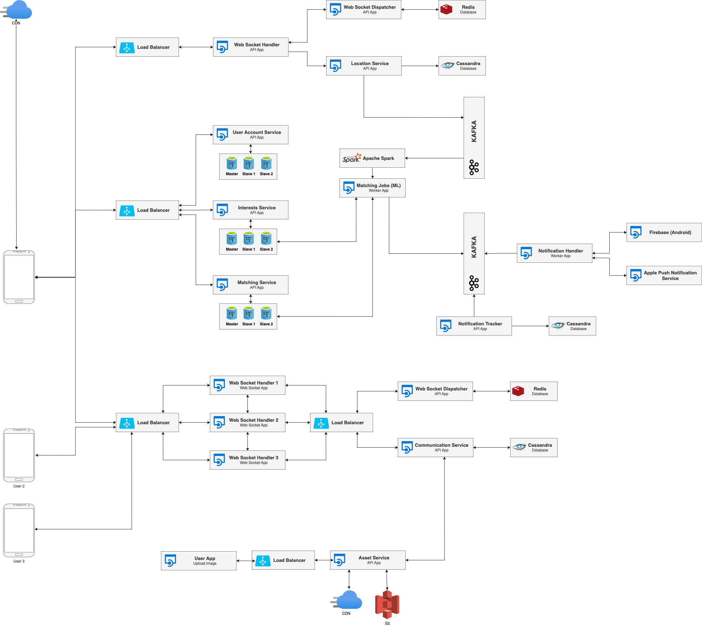

# GeoMatch (Draft)

## Functional Requirements (FR)

- User registration: Users should be able to register for the system by creating a user account and providing their location information.
- Location tracking: The system should be able to track the location of users in real-time, either by accessing their device's GPS data or by having them enter their location manually.
- Matching algorithm: The system should have an algorithm that compares the locations of different users and determines which users are a good match based on their proximity to each other.
- Match presentation: The system should present matched users to each other in a user-friendly interface, such as a list or map view.
- Communication: The system should provide a way for matched users to communicate with each other, either through the system itself or by integrating with external communication tools.
- User preferences: Users should be able to specify their preferences for the type of match they are looking for (e.g. age range, gender, interests) and the system should take these preferences into account when making matches.
- Match history: The system should keep a record of past matches for each user.
- Privacy and security: The system should have measures in place to protect the privacy and security of user data.

## Non Functional Requirements (NFR)

- Reliability: The system should be reliable and consistently produce accurate matches.
- Availability: The system should be available to users at all times, with minimal downtime.
- Security: The system should have measures in place to protect the privacy and security of user data.
- Scalability: The system should be able to handle a large number of users and handle an increase in traffic without performance issues.
- Performance: The system should be fast and responsive, with a short turnaround time for matching users.
- Usability: The system should be easy for users to understand and use.
- Maintainability: The system should be easy to maintain and update over time.
- Portability: The system should be able to run on a variety of platforms and devices.
- Interoperability: The system should be able to integrate with other systems and technologies as needed.
- Localization: The system should be able to support multiple languages and be able to adapt to different cultural norms.

## System Architecture

## TODO Детали позже опишу